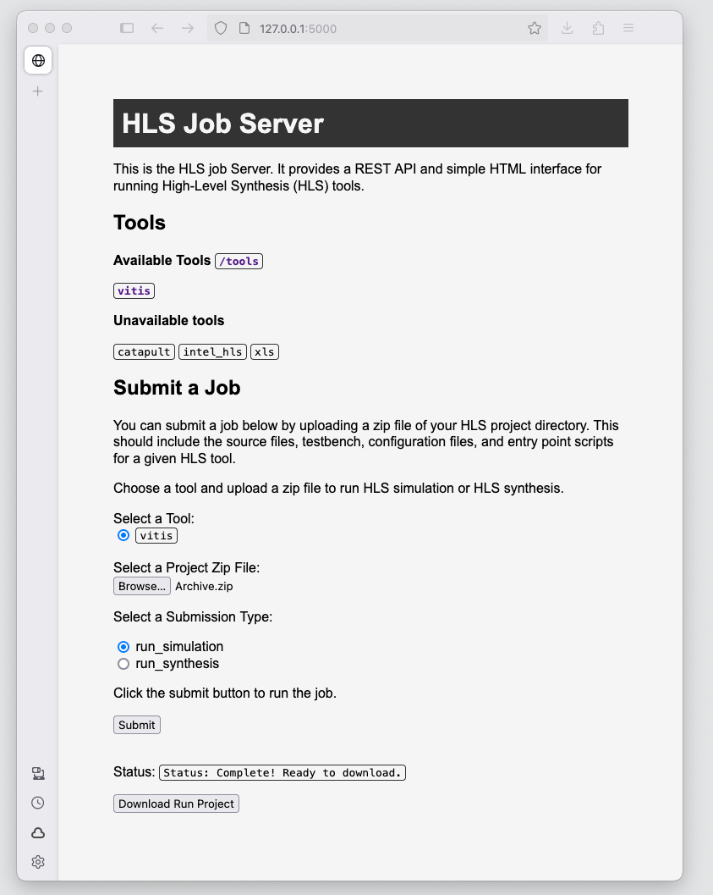

# hls-job-server

A job server for running High Level Synthesis (HLS) tools.

Originally developed for integated as a class project leaderboard where students could submit their HLS project which would automatically be synthesized, tested, and scored on a class leaderboard based on latency and resource utilization.

Currently a work in progress. Initial Vitis HLS support is working. More tool support to come. Stay tuned!
